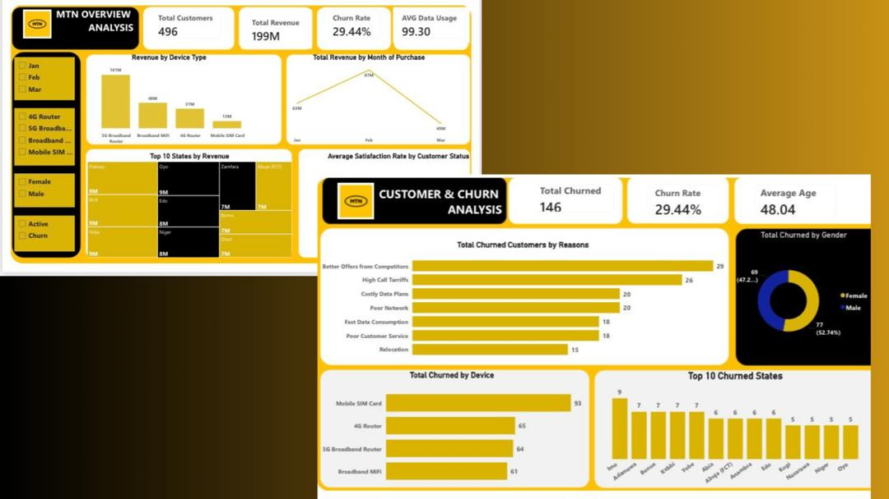
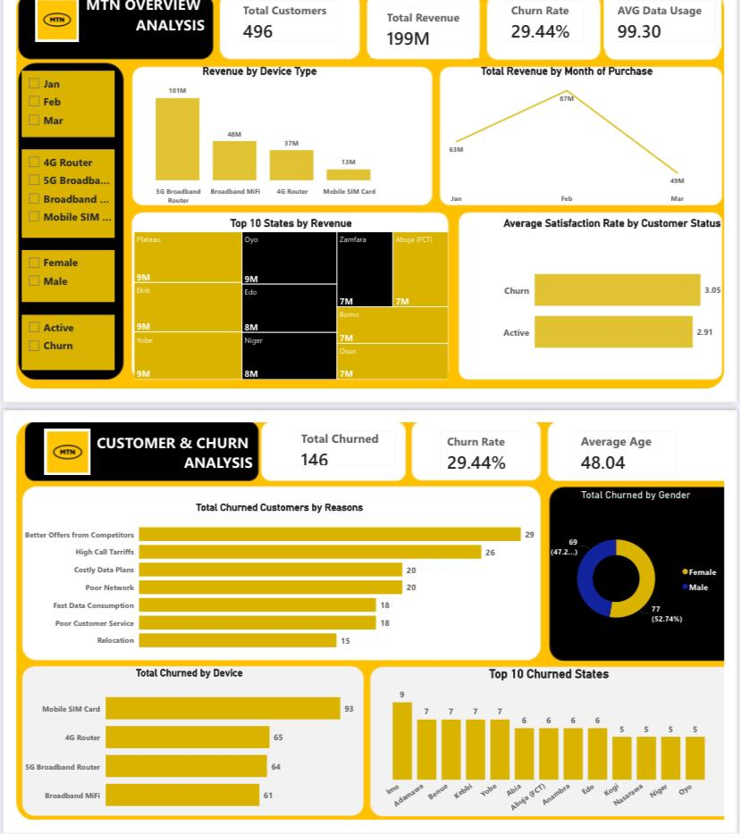

# mtn-customer-churn-analysis
📊 MTN Customer Churn & Revenue Analysis

🔍 Project Overview

This project analyzes customer behavior, revenue trends, and churn patterns in a telecom company using an interactive dashboard.

🎯 Objectives
	•	Understand customer churn
	•	Identify revenue drivers
	•	Analyze customer usage patterns

🛠️ Tools Used
	•	Power BI for DAX measurement

📂 Dataset

The dataset includes:
	•	Customer demographics
	•	Device type
	•	Data usage
	•	Churn status

📈 Key Insights
	•	Customers churn mostly due to competitor offers and high tariffs
	•	February recorded the highest revenue
	•	Mobile SIM users have the highest churn rate
	•	Certain states contribute more to churn

🖼️ Dashboard Preview

💡 Recommendations
	•	Improve network quality
	•	Reduce tariffs
	•	Offer retention incentives
